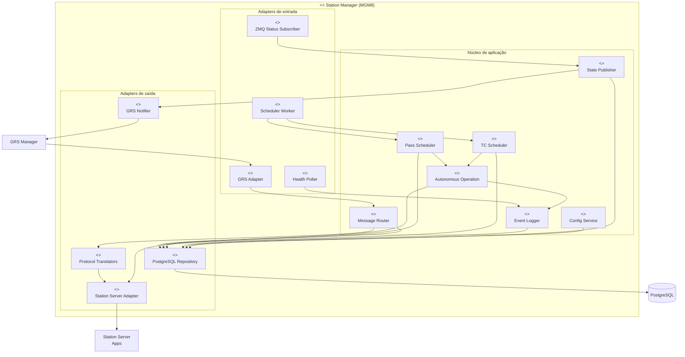
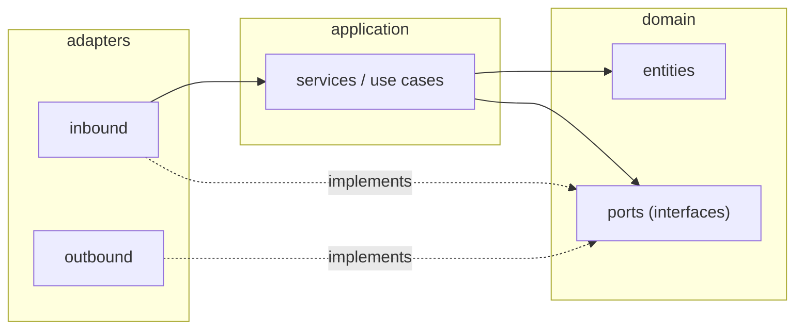
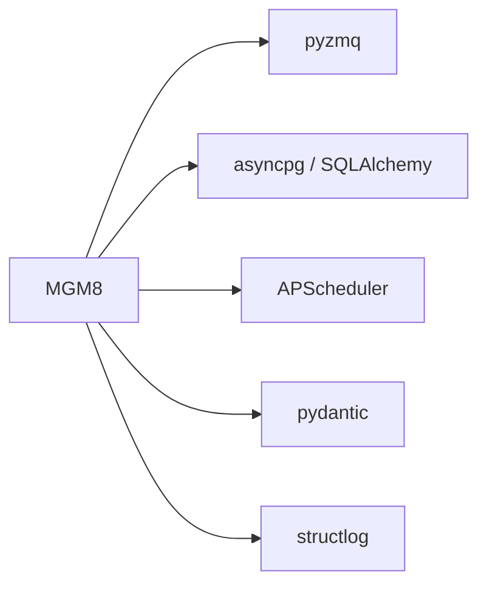

# Diagrama de componentes

Visão UML de componentes do MGM8 e suas dependências externas.

## Componentes internos do MGM8

## Interfaces (ports) expostas

| Componente | Porta | Protocolo | Consumidor |
|------------|-------|-----------|------------|
| GRS Adapter | `IGRSCommandPort` | ZMQ REQ/REP | GRS Manager |
| GRS Notifier | `IStationStatePort` | ZMQ PUB | GRS Manager |
| Station Server Adapter | `IStationCommandPort` | ZMQ PUSH/REQ/PUB | Microserviços SS |
| PostgreSQL Repository | `IStationRepository` | SQL/asyncpg | Todos os services |
| Protocol Translators | `IProtocolTranslator` | In-process | Message Router |

## Diagrama de pacotes

## Dependências externas

| Biblioteca | Uso |
|------------|-----|
| **pyzmq** | Comunicação com GRS Manager e Station Server |
| **asyncpg** | Acesso assíncrono ao PostgreSQL |
| **APScheduler** | Disparo de passagens e TCs agendados |
| **pydantic** | Validação de mensagens e DTOs |
| **structlog** | Logs estruturados → `system_logs` |
