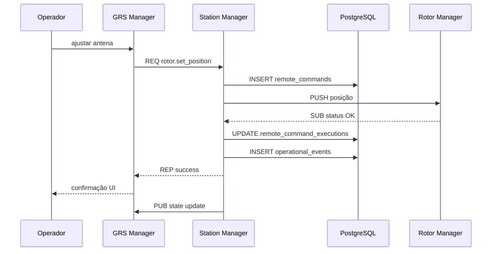
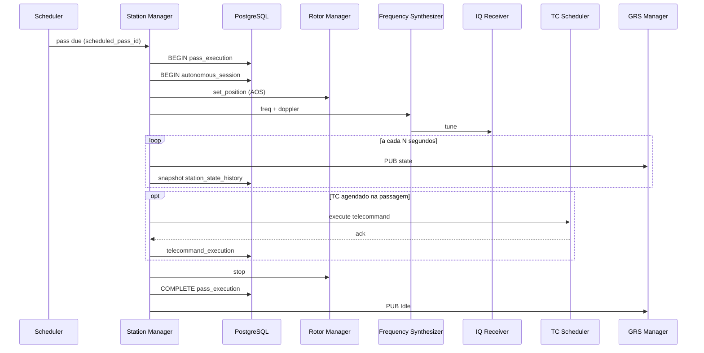

# Integração com subsistemas

## Mapa de integrações

```mermaid
flowchart LR
    MGM["Station Manager"]
    
    GRS["GRS Manager\n(Control Desktop)"]
    PG[("PostgreSQL")]
    GP["GPredict"]
    TC["TC Generator"]
    
    IQ["IQ Receiver"]
    ROT["Rotor Manager"]
    FREQ["Frequency Synthesizer"]
    RF["RF Front-End"]
    DEC["Decoders"]
    ENC["Encoders"]

    GRS <-->|"ZMQ REQ/REP\ncomandos + queries"| MGM
    GRS <-->|"ZMQ SUB\nestado da estação"| MGM
    MGM --> PG
    MGM -->|"ZMQ PUSH/REQ"| ROT
    MGM -->|"ZMQ PUB\nfreq/doppler"| FREQ
    MGM -->|"ZMQ REQ/REP"| RF
    MGM -->|"ZMQ SUB\nhealth/status"| IQ
    GP -.->|"TLE / passagens\n(via GRS ou import)"| MGM
    TC -.->|"definições TC\n(via mission_control DB)"| MGM
    DEC --> PG
    ENC <-- MGM
```

## GRS Manager

| Aspecto | Detalhe |
|---------|---------|
| **Papel** | Interface unificada do operador |
| **Protocolo** | ZeroMQ REQ/REP para comandos; SUB para estado |
| **Mensagens típicas** | `start_pass`, `stop_pass`, `send_tc`, `get_state`, `schedule_pass`, `get_logs` |
| **Responsabilidade do MGM8** | Validar, rotear, persistir, publicar estado |

### Exemplo de mensagem de comando (JSON sobre ZMQ)

```json
{
  "type": "command",
  "id": "cmd-uuid-001",
  "action": "rotor.set_position",
  "payload": {
    "azimuth_deg": 145.2,
    "elevation_deg": 32.8
  },
  "timestamp": "2026-07-22T15:30:00Z"
}
```

### Exemplo de publicação de estado

```json
{
  "type": "station_state",
  "mode": "PassActive",
  "active_pass_id": "pass-uuid-001",
  "satellite": "FloripaSat-2A",
  "rotor": { "azimuth_deg": 145.2, "elevation_deg": 32.8 },
  "frequency_hz": 437200000,
  "applications": {
    "iq_receiver": "healthy",
    "rotor_manager": "healthy",
    "demodulator": "healthy"
  },
  "timestamp": "2026-07-22T15:35:00Z"
}
```

## Station Server — microserviços

| Microserviço | Interface MGM8 | Comandos |
|--------------|----------------|----------|
| **Rotor Manager** | ZMQ PUSH + SUB status | `set_position`, `stop`, `request_status` |
| **Frequency Synthesizer** | ZMQ PUB (embedded ou externo) | `freq`, `doppler` |
| **IQ Receiver** | Indireto via FreqSyn; SUB status | start/stop via pipeline |
| **RF Front-End** | ZMQ REQ/REP | switching LNA/PA, attenuators |
| **Demodulator / Pipeline** | SUB status Pub/Sub | monitoramento apenas |

## PostgreSQL — schemas relacionados

| Schema | Responsável | Relação com MGM8 |
|--------|-------------|------------------|
| `station_manager` | MGM8 | Schema principal deste projeto |
| `mission_control` | Database GRS | Satélites, definições de pacotes — leitura por FK |
| `telemetry_stream` | Decoders | Telemetria time-series — MGM8 não escreve diretamente |

### Integração com `mission_control`

O MGM8 referencia satélites e telecomandos definidos no schema existente:

```sql
-- scheduled_passes.satellite_id → mission_control.satellites(id)
-- scheduled_telecommands.telecommand_definition_id → mission_control.telecommands(id)
```

## GPredict

| Aspecto | Detalhe |
|---------|---------|
| **Uso** | Predição orbital e janelas AOS/LOS |
| **Integração** | Import manual de passagens ou API futura; operador confirma no GRS |
| **Dados consumidos** | TLE, AOS, LOS, azimuth/elevation profile |

## TC Generator / TC Scheduler

| Aspecto | Detalhe |
|---------|---------|
| **TC Generator** | Define e armazena telecomandos (Control Desktop / serviço web) |
| **Satellite TC Scheduler** | Componente do Control Server — encapsulação DL/Network |
| **MGM8** | Agenda e dispara execução; encaminha ao scheduler/encoder |

## Sequência — comando remoto do operador



## Sequência — passagem autônoma completa



## Tratamento de falhas

| Cenário | Ação do MGM8 |
|---------|--------------|
| Timeout ZMQ com Rotor | Retry 3x → marca Degraded → UC12 |
| IQ Receiver offline | Aborta passagem → FAILED → notifica GRS |
| PostgreSQL indisponível | Buffer em memória (limitado) → alerta crítico |
| GRS Manager desconectado | Continua autônomo se configurado |
| Conflito de agenda | Rejeita novo agendamento (UC08) |
