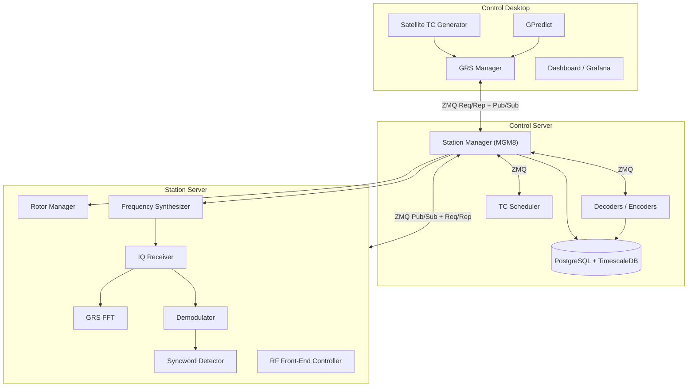
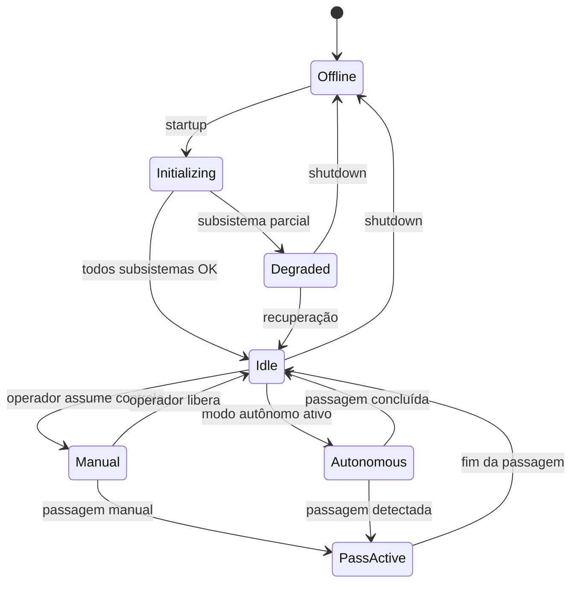

# Visão geral da arquitetura

## Contexto no ecossistema GRS

O **Ground Station Manager (MGM8)** é o middleware central no **Control Server**. Ele não controla hardware diretamente; coordina os microserviços do **Station Server** e expõe um ponto único de contato para o **GRS Manager** no **Control Desktop**.

## Responsabilidades do MGM8

| Domínio | Responsabilidade |
|---------|------------------|
| **Comunicação** | Receber comandos do GRS Manager, encaminhar ao Station Server, traduzir protocolos, detectar falhas e reconectar |
| **Agendamento** | Passagens de satélite, transmissões de TC, execução automática, detecção de conflitos |
| **Operação autônoma** | Detectar passagens, iniciar pipeline RF, acionar TCs, registrar eventos, recuperar de falhas |
| **Registro** | Logs de sistema, eventos operacionais, auditoria de configuração |
| **Persistência** | Estado da estação, agendamentos, histórico de conexões e comandos no PostgreSQL |
| **Monitoramento** | Integridade dos aplicativos conectados; publicação de estado para o GRS Manager |

## Fronteiras explícitas

**Dentro do escopo do MGM8:**
- Orquestração e estado operacional da estação
- Roteamento de mensagens entre GRS Manager ↔ Station Server
- Agendamento e execução autônoma
- Schema `station_manager` no PostgreSQL

**Fora do escopo (delegado a outros componentes):**
- Processamento RF/IQ, demodulação, FFT → Station Server
- Decodificação de telemetria e armazenamento em hypertables → Decoders + schema `telemetry_stream`
- Metadados de missão e definições de pacotes → schema `mission_control`
- Interface gráfica do operador → GRS Manager
- Predição orbital → GPredict

## Estados operacionais da estação

## Modos de operação

| Modo | Descrição | Gatilho |
|------|-----------|---------|
| **Manual** | Operador controla via GRS Manager | Operador conectado e ativo |
| **Autônomo** | MGM8 executa passagens e TCs agendados | Sem operador ativo + agenda configurada |
| **Degradado** | Operação parcial; subsistemas indisponíveis | Falha detectada em health check |
| **Manutenção** | Bloqueia operações automáticas | Configuração explícita |
