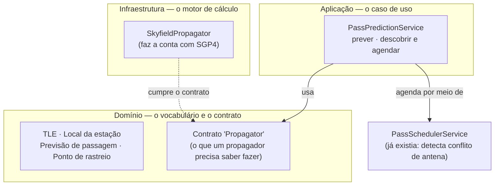

# Propagador de órbita — o que foi feito e por quê

> Documento de leitura acessível. Para a referência técnica (assinaturas,
> endpoints, formato JSON) veja [propagation.md](propagation.md).

## 1. O problema que motivou este trabalho

Para uma passagem de satélite acontecer, a estação precisa saber **três coisas**:

1. **Quando** o satélite vai estar visível (janela de passagem: início, pico, fim).
2. **Para onde apontar a antena** a cada instante (azimute e elevação).
3. **Qual a correção de frequência do rádio** — por causa do efeito Doppler, a
   frequência recebida muda enquanto o satélite se aproxima e depois se afasta.

Hoje quem faz essas contas na estação é o **GPredict**. O problema: o GPredict é
um programa de tela (GUI). Ele não tem uma "porta de entrada" para outro
programa mandar comando nele. Uma pessoa precisa abrir o GPredict, escolher o
satélite e clicar em "engatar rotor". **Isso impede a operação autônoma** — o
requisito central do Station Manager é a estação funcionar sozinha quando não há
operador.

A saída é a estação ter o **seu próprio "rastreador de satélite"**: um pedaço de
código que faz as mesmas contas do GPredict, mas que pode ser chamado
automaticamente. Foi isso que este item entregou.

O GPredict continua útil — só que para **modo manual** (o operador acompanhando a
passagem na tela) e não mais como peça da automação.

## 2. O que é um "propagador", em linguagem simples

Um propagador é como um **GPS do satélite**. Você dá a ele:

| Entrada | O que é |
|---------|---------|
| **TLE** | O "endereço orbital" do satélite — duas linhas de texto, padrão mundial, publicadas por serviços como o Celestrak. Descrevem a órbita naquele momento. |
| **Local da estação** | Latitude, longitude e altitude da antena. |
| **Um instante de tempo** | "Onde está o satélite às 15h20?" |

E ele devolve **onde o satélite está no céu visto da sua antena**: direção
(azimute), altura acima do horizonte (elevação), distância, e a velocidade com
que essa distância está mudando (que é o que gera o Doppler).

O método de cálculo se chama **SGP4** — é o algoritmo padrão da indústria para
propagar órbitas a partir de um TLE. Não reimplementamos o SGP4; usamos uma
biblioteca consagrada (`skyfield`).

## 3. O que foi implementado

A implementação segue a **arquitetura hexagonal** que o projeto já usa: o
"miolo" (regras de negócio) não sabe qual biblioteca faz a conta; ele só conhece
um **contrato**. Isso deixa a biblioteca trocável no futuro.



### 3.1. O vocabulário (camada de domínio)

Quatro "tipos de dado" novos, sem nenhuma dependência externa:

- **`TLE`** — guarda as duas linhas do endereço orbital e confere se estão no
  formato certo (69 caracteres cada). Sabe extrair o número de catálogo do
  satélite (ex.: `25544` = ISS).
- **`GroundStationLocation`** — a posição geográfica da antena. Já vem com um
  atalho `spacelab_ufsc()` com as coordenadas da estação em Florianópolis, que é
  o padrão quando ninguém informa outro local.
- **`PassPrediction`** — uma passagem prevista: horário de início (AOS), pico e
  fim (LOS), elevação máxima e os azimutes. Sabe se converter na "janela de
  passagem" que o agendador já entende.
- **`TrackingPoint`** — a posição do satélite num instante: azimute, elevação,
  distância e taxa de variação da distância. É aqui que mora a **conta do
  Doppler**: `desvio = −frequência × (taxa_de_distância / velocidade_da_luz)`.
  Também converte direto para o comando de posição da antena.

### 3.2. O contrato (porta `Propagator`)

Define **o que** qualquer propagador precisa saber fazer, sem dizer **como**:

- `predict_passes(...)` — dada uma janela de tempo, liste as passagens acima de
  uma elevação mínima.
- `track(...)` — onde está o satélite neste instante exato.
- `sample_track(...)` — a trajetória completa da passagem, ponto a ponto (ex.: de
  segundo em segundo), para alimentar o rotor e o rádio durante a passagem.

### 3.3. O motor (`SkyfieldPropagator`, camada de infraestrutura)

É o **único arquivo do projeto que importa `skyfield` e `numpy`**. Ele traduz o
contrato acima em chamadas à biblioteca: usa a função de "eventos" do skyfield
para achar subida/pico/descida de cada passagem, e calcula distância e Doppler a
partir dos vetores de posição e velocidade.

Como está isolado atrás do contrato, se um dia quisermos trocar por outra
biblioteca (ou por um serviço externo), muda só este arquivo.

### 3.4. O caso de uso (`PassPredictionService`, camada de aplicação)

Duas operações:

- **Prever** (`preview_passes`) — "quais as passagens da ISS nas próximas 24 h?".
  Só calcula e devolve a lista. Não grava nada.
- **Descobrir e agendar** (`discover_and_schedule`) — calcula as passagens **e já
  as coloca na agenda**, uma por uma, passando pelo `PassSchedulerService` que já
  existia. Ou seja: reaproveita a detecção de conflito de recurso de RF (duas
  passagens não podem disputar a mesma antena) em vez de reimplementá-la.

  Tem **proteção contra duplicata**: se você rodar a descoberta de novo (por
  exemplo, de 6 em 6 horas), ela não recria passagens que já estão agendadas para
  o mesmo satélite (compara o horário de início com tolerância de 60 s). O
  resultado vem separado em três listas: `agendadas`, `em conflito` e
  `já conhecidas`.

  Ao final, registra um evento operacional de resumo ("descoberta concluída: 3
  agendadas, 0 em conflito, 0 já conhecidas").

### 3.5. As duas rotas HTTP

| Rota | Para quê |
|------|----------|
| `POST /api/passes/predict` | Só prever — útil para o operador conferir antes |
| `POST /api/passes/discover` | Prever e já agendar automaticamente |

O corpo é um JSON com o TLE, a frequência e (opcionalmente) o local e o
horizonte de tempo. Detalhes e exemplo em [propagation.md](propagation.md).

### 3.6. Dependência opcional

O `skyfield` é **instalação opcional** (`pip install -e ".[propagation]"`, já
incluído no `.[dev]`). Se não estiver instalado, a aplicação **sobe normalmente**
e apenas essas duas rotas respondem `503` com uma mensagem explicando como
instalar. Nada mais no sistema depende do `skyfield`.

## 4. Por que cada decisão

| Decisão | Motivo |
|---------|--------|
| **Propagador próprio em vez do GPredict** | O GPredict não pode ser comandado por outro programa. Sem propagador próprio, não há operação autônoma. |
| **Usar `skyfield` (não escrever o SGP4)** | SGP4 é matemática orbital delicada; `skyfield` é a implementação padrão, testada e mantida pela comunidade. |
| **Isolar o `skyfield` atrás de um contrato** | O domínio e a aplicação não devem depender de biblioteca. Assim dá para testar sem `skyfield` e trocar o motor depois sem mexer no resto. |
| **Agendar via `PassSchedulerService` já existente** | A regra "não pode haver duas passagens na mesma antena ao mesmo tempo" já estava implementada. Reaproveitar evita duplicar lógica e divergir. |
| **Proteção contra duplicata** | A descoberta vai rodar repetidamente (num timer, no futuro). Sem isso, cada execução encheria a agenda de cópias. |
| **`skyfield` como dependência opcional** | Quem só quer rodar o agendamento manual e a interface web não precisa baixar `numpy` + dados de efemérides. |
| **Testes com um "propagador falso"** | A lógica de descoberta/dedupe/conflito é testada de forma rápida e determinística, sem depender de `skyfield` nem de TLE real. Um teste de integração separado (marcado para pular se faltar a lib) valida a conta real. |

## 5. Exemplo real (o que já roda hoje)

Enviando à rota `/api/passes/discover` um TLE da ISS e horizonte de 24 h, a
resposta foi:

```
status 201
agendadas 3   em conflito 0   já conhecidas 0

primeira passagem:
  início (AOS):        15:17:22  azimute 317.5°  (noroeste)
  pico:                15:20:01  azimute 228.1°  elevação máxima 86.4°  (quase no zênite)
  fim (LOS):           15:22:42  azimute 138.2°  (sudeste)
  duração:             320.8 s  (~5 min 20 s)
```

Rodando a **mesma chamada de novo**: `agendadas 0, já conhecidas 3` — a proteção
contra duplicata funcionou.

Testes automatizados: `18 passed` (inclui a propagação real da ISS sobre
Florianópolis via `skyfield`).

## 6. O que este item ainda NÃO faz

- Não roda sozinho num timer — hoje alguém (ou um outro serviço) precisa chamar a
  rota. O **worker de agendamento** que dispara isso periodicamente é o item 3 do
  plano.
- Não comanda o rotor nem o sintetizador de frequência diretamente — ele produz
  os números (`sample_track`, `to_antenna_position`, `doppler_shift_hz`); quem os
  envia via ZMQ para o Station Server são os **adaptadores ZMQ**, item 4.
- Não busca TLEs atualizados automaticamente — o TLE entra pela chamada. A
  integração com Celestrak / `mission_control` para manter os TLEs frescos é um
  próximo passo (um TLE velho dá previsão errada).
