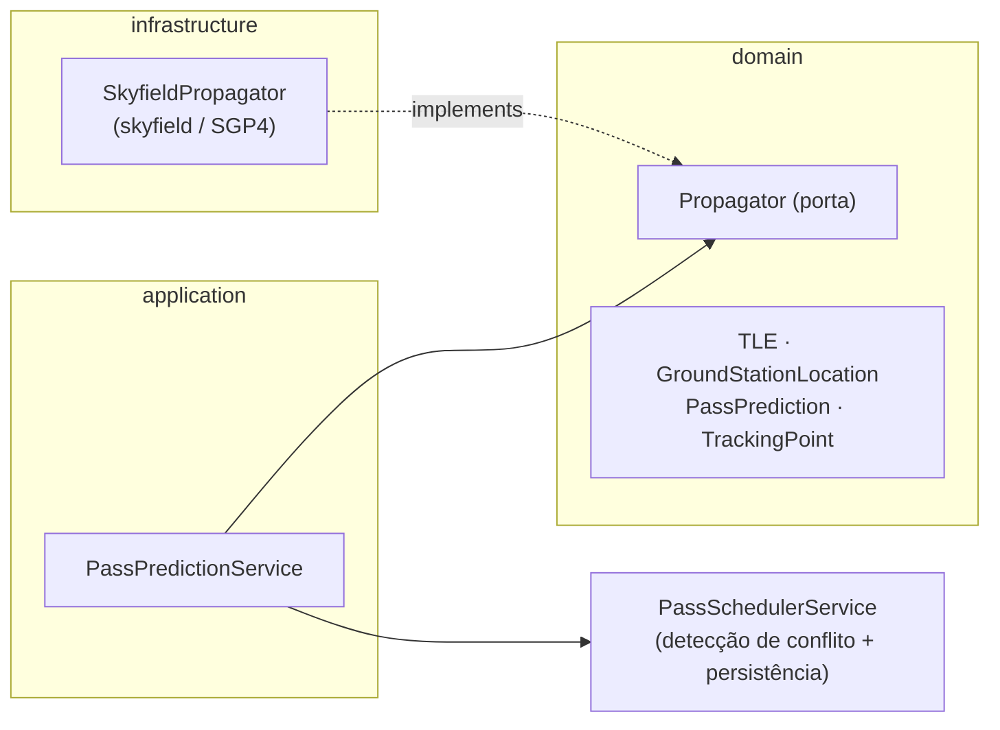

# Propagação orbital (satellite tracker)

> Referência técnica. Para uma explicação em linguagem acessível ("o que foi
> feito e por quê"), veja [propagation-explained.md](propagation-explained.md).

O MGM8 tem seu **próprio rastreador de satélites** (SGP4). Ele é a fonte única
de janelas de passagem, ângulos de apontamento (az/el) e desvio Doppler no
**modo autônomo**.

## Por que não depender do GPredict

O GPredict é um cliente de GUI (fala `rotctld`/`rigctld` via hamlib) e **não tem
API de entrada** — ninguém consegue dizer "rastreie o satélite X agora"
programaticamente. Para operação autônoma isso é um bloqueio estrutural.

| Ferramenta | Papel |
|------------|-------|
| **GPredict** | Modo manual e situational awareness — operador acompanha a passagem, faz jog do rotor |
| **Propagador MGM8** | Caminho de automação — descobre passagens e calcula az/el/Doppler sem operador |

O fluxo de dados de RF (IQ → demod → decoder) nunca passa pelo GPredict.

## Camadas



- **`domain/ports.py::Propagator`** — `predict_passes`, `track`, `sample_track`.
- **`domain/models.py`** — value objects `TLE`, `GroundStationLocation`
  (`GroundStationLocation.spacelab_ufsc()` = UFSC/Florianópolis), `PassPrediction`,
  `TrackingPoint` (com `doppler_shift_hz()` e `to_antenna_position()`).
- **`application/pass_predictor.py::PassPredictionService`**
  - `preview_passes(...)` — só prediz, não persiste.
  - `discover_and_schedule(request)` — prediz e agenda cada passagem via
    `PassSchedulerService` (reaproveita a detecção de conflito de recurso RF);
    deduplica contra passagens já agendadas do mesmo satélite (AOS ± 60 s).
- **`infrastructure/skyfield_propagator.py::SkyfieldPropagator`** — único módulo
  que importa `skyfield`/`numpy`. Instalação opcional: `pip install "mgm8[propagation]"`.

## Doppler

`shift_hz = -f_emitida * (range_rate_m_s / c)` — positivo quando o satélite se
aproxima (range rate negativo). `TrackingPoint.observed_frequency_hz(f)` devolve
a frequência já corrigida para o Frequency Synthesizer.

## Endpoints HTTP

| Método | Rota | Descrição |
|--------|------|-----------|
| `POST` | `/api/passes/predict` | Prevê passagens para um TLE; não persiste |
| `POST` | `/api/passes/discover` | Prevê e agenda; retorna `scheduled` / `conflicts` / `duplicates` |

Corpo (JSON):

```json
{
  "satellite_id": "uuid (só no discover)",
  "center_frequency_hz": 437200000,
  "tle": { "name": "FLORIPASAT-1", "line1": "1 44885U...", "line2": "2 44885..." },
  "location": { "latitude_degrees": -27.6009, "longitude_degrees": -48.5197, "altitude_meters": 10 },
  "horizon_hours": 24,
  "min_elevation_degrees": 5.0
}
```

`location` é opcional — o default é a estação do SpaceLab. Sem o extra
`propagation` instalado, os dois endpoints respondem `503`.

## Encaixe no modo autônomo (próximos passos)

1. Um worker periódico chama `discover_and_schedule` por satélite (TLEs vindos do
   `mission_control` / Celestrak).
2. O Scheduler Worker dispara a passagem em AOS − lead time e usa
   `sample_track` para alimentar Rotor Manager (az/el) e Frequency Synthesizer
   (curva de Doppler) durante toda a janela.
3. `TrackingPoint.to_antenna_position()` já entrega um `AntennaPosition` válido
   para o comando do rotor.
