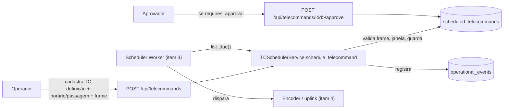

# Agendamento de telecomando (TC)

> Explicação acessível. Complementa [use-cases.md](use-cases.md) (UC06, UC11).

## O que foi feito

A segunda metade do requisito "scheduling": além de agendar **passagens**, a
estação agora agenda **transmissões de telecomando** — o comando que sobe para o
satélite.

O modelo `ScheduledTelecommand` já existia; este item adicionou a lógica ao
redor dele: porta, repositório, serviço de aplicação, rotas HTTP, aba na
interface web e testes — no mesmo padrão do agendador de passagens.

## A decisão central: o TC é opaco

O MGM8 **não interpreta** o comando. Ele guarda:

- `telecommand_definition_id` — referência à definição no TC Generator /
  `mission_control` (o que o comando é);
- `parameters` — valores que o operador preencheu;
- `frame_hex` — opcionalmente, o frame já codificado, em hexadecimal. O MGM8
  trata isso como **bytes opacos**.

A validação feita aqui é **estrutural e operacional**, nunca semântica:

| Regra | Motivo |
|-------|--------|
| `frame_hex`, se informado, tem que ser hexadecimal válido e ≤ 4096 bytes | Evita mandar lixo para o rádio; não olha o *conteúdo* |
| `priority` entre 1 e 9 | Sanidade |
| TC vinculado a uma passagem tem que executar **dentro da janela** dessa passagem | Não adianta transmitir com o satélite fora de vista |
| Dois TCs não podem transmitir dentro de um intervalo de guarda (5 s por padrão) | O uplink é um recurso único |
| `requires_approval` → não fica "pronto para execução" sem `approved_by` | Comando sensível passa por dupla checagem |

## Fluxo



`list_due(as_of)` devolve só os TCs cujo horário já chegou **e** que estão
prontos (aprovados, se exigirem aprovação). É o gancho que o worker de
agendamento (item 3) vai consumir.

## Endpoints HTTP

| Método | Rota | Descrição |
|--------|------|-----------|
| `GET` | `/api/telecommands` | Lista todos |
| `POST` | `/api/telecommands` | Agenda; `201` ok, `409` conflito de guarda, `400` dados inválidos |
| `POST` | `/api/telecommands/<id>/approve` | Aprova (corpo `{"approved_by": "..."}`) |
| `POST` | `/api/telecommands/<id>/cancel` | Cancela |

Corpo do `POST /api/telecommands`:

```json
{
  "telecommand_definition_id": "uuid",
  "execute_at": "2030-01-01T10:04:00+00:00",
  "scheduled_pass_id": "uuid (opcional)",
  "parameters": { "modo": 2 },
  "frame_hex": "40 7e 12 00 ff (opcional)",
  "priority": 5,
  "requires_approval": true
}
```

Na interface web há a aba **Telecommands** com o formulário e os botões de
aprovar/cancelar por linha.

## O que ainda falta

- **Disparo automático** — `list_due()` existe, mas quem chama de tempos em
  tempos é o Scheduler Worker (item 3).
- **Envio real** — a codificação final (camadas DL/Network) e o uplink via ZMQ
  são dos Encoders / adaptadores do Station Server (item 4). Hoje o TC só é
  agendado e registrado.
- **Contrato com o grs-tc-generator** — falta fixar em que formato a definição /
  frame chega (REST? arquivo? escrita em `mission_control`?). O campo `frame_hex`
  já cobre o caso "operador cola o frame pronto".
