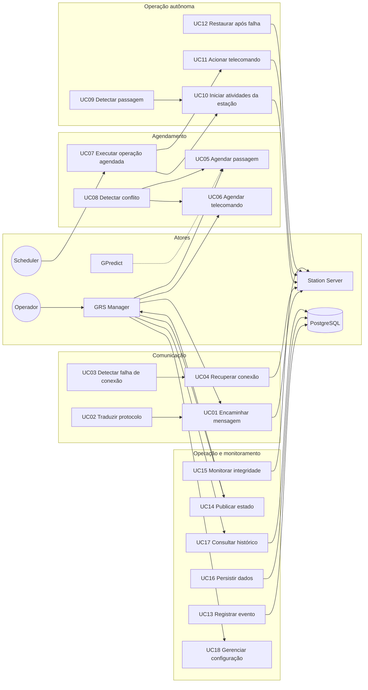
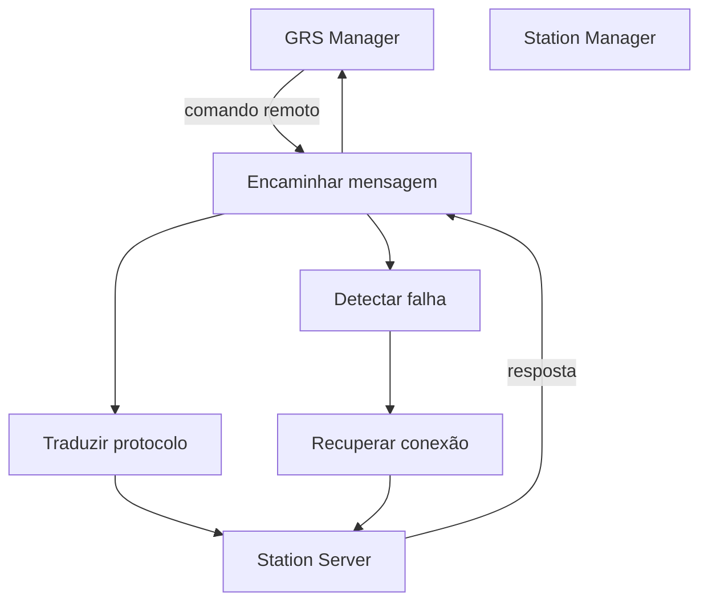
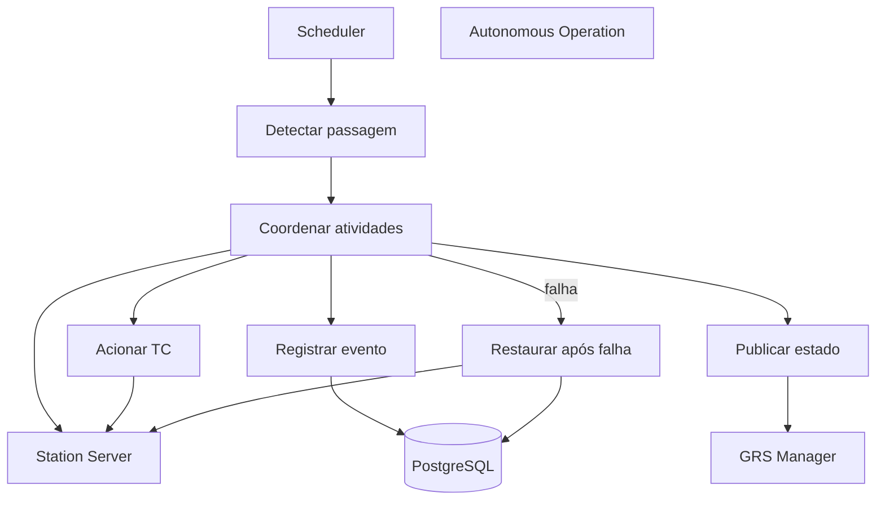

# Casos de uso

## Atores

| Ator | Tipo | Descrição |
|------|------|-----------|
| **Operador** | Humano | Controla a estação via GRS Manager no Control Desktop |
| **GRS Manager** | Sistema | Aplicação HMI que envia comandos e exibe estado |
| **Station Server** | Sistema | Conjunto de microserviços RF/DSP no servidor de estação |
| **GPredict / Propagador** | Sistema | Fornece TLEs e janelas de passagem |
| **TC Generator** | Sistema | Gera e armazena definições de telecomandos |
| **PostgreSQL** | Sistema | Persistência de dados operacionais |
| **Scheduler (interno)** | Sistema | Worker interno do MGM8 para disparos temporais |

## Diagrama geral de casos de uso

## Catálogo de casos de uso

### Comunicação

#### UC01 — Encaminhar mensagem entre GRS Manager e Station Server

| Campo | Valor |
|-------|-------|
| **Ator principal** | GRS Manager |
| **Pré-condições** | MGM8 em execução; destino registrado e saudável |
| **Fluxo principal** | 1. GRS envia comando via ZMQ REQ → 2. MGM8 valida e identifica destino → 3. Traduz se necessário (UC02) → 4. Encaminha ao microserviço → 5. Retorna resposta ao GRS |
| **Pós-condições** | Comando executado ou erro registrado (UC13) |
| **Extensões** | 3a. Destino indisponível → UC03 |

#### UC02 — Traduzir protocolo de comunicação

| Campo | Valor |
|-------|-------|
| **Ator principal** | MGM8 (interno) |
| **Descrição** | Converte mensagens do formato GRS para o formato ZMQ nativo de cada microserviço (rotor, frequency synthesizer, etc.) |

#### UC03 — Detectar falha de conexão

| Campo | Valor |
|-------|-------|
| **Ator principal** | MGM8 (Health Poller) |
| **Fluxo principal** | 1. Timeout ou heartbeat ausente → 2. Marca app como UNHEALTHY → 3. Registra em `application_connections` → 4. Publica estado degradado (UC14) |

#### UC04 — Recuperar conexão automaticamente

| Campo | Valor |
|-------|-------|
| **Ator principal** | MGM8 |
| **Fluxo principal** | 1. Detecta reconexão ou retry bem-sucedido → 2. Atualiza status → 3. Registra evento → 4. Restaura estado operacional se aplicável |

---

### Agendamento

#### UC05 — Agendar passagem de satélite

| Campo | Valor |
|-------|-------|
| **Ator principal** | Operador (via GRS Manager) |
| **Pré-condições** | Satélite cadastrado; janela de visibilidade conhecida |
| **Fluxo principal** | 1. Operador informa satélite, AOS, LOS, frequência → 2. MGM8 valida → 3. Verifica conflitos (UC08) → 4. Persiste em `scheduled_passes` → 5. Confirma ao GRS |
| **Dados de entrada** | `satellite_id`, `aos`, `los`, `center_frequency_hz`, `doppler_source` |

#### UC06 — Agendar transmissão de telecomando

| Campo | Valor |
|-------|-------|
| **Ator principal** | Operador (via GRS Manager) |
| **Fluxo principal** | 1. Seleciona TC (referência ao TC Generator / `mission_control`) → 2. Define horário ou vincula a passagem → 3. Valida conflitos → 4. Persiste em `scheduled_telecommands` |

#### UC07 — Executar operação agendada

| Campo | Valor |
|-------|-------|
| **Ator principal** | Scheduler interno |
| **Fluxo principal** | 1. Consulta operações `due` → 2. Para passagem: UC10 → 3. Para TC: UC11 → 4. Atualiza status de execução |

#### UC08 — Detectar conflito de agendamento

| Campo | Valor |
|-------|-------|
| **Ator principal** | MGM8 |
| **Regra** | Sobreposição temporal no mesmo recurso (antena/RF) |
| **Fluxo alternativo** | Rejeita agendamento e retorna conflitos identificados |

---

### Operação autônoma

#### UC09 — Detectar passagem de satélite (modo autônomo)

| Campo | Valor |
|-------|-------|
| **Ator principal** | MGM8 |
| **Pré-condições** | Modo autônomo habilitado; nenhum operador ativo |
| **Fluxo principal** | 1. Scheduler identifica passagem iminente → 2. Verifica saúde dos subsistemas → 3. Inicia UC10 |

#### UC10 — Iniciar e coordenar atividades da estação

| Campo | Valor |
|-------|-------|
| **Ator principal** | MGM8 (Autonomous Operation Service) |
| **Fluxo principal** | 1. Comanda rotor (az/el) → 2. Configura frequência + Doppler → 3. Inicia IQ Receiver → 4. Monitora passagem → 5. Encerra pipeline ao LOS |

#### UC11 — Acionar transmissão de telecomando

| Campo | Valor |
|-------|-------|
| **Ator principal** | MGM8 |
| **Fluxo principal** | 1. Recupera TC agendado → 2. Encapsula via encoders → 3. Envia ao Station Server → 4. Registra execução |

#### UC12 — Restaurar funcionamento após falha

| Campo | Valor |
|-------|-------|
| **Ator principal** | MGM8 |
| **Fluxo principal** | 1. Detecta falha mid-pass → 2. Para subsistemas de forma segura → 3. Registra evento → 4. Tenta retry ou marca passagem como FAILED → 5. Retorna a Idle/Degraded |

---

### Registro, persistência e monitoramento

#### UC13 — Registrar evento operacional

Eventos: startup/shutdown, warnings, erros, conexões, operações agendadas, TCs, aprovações, mudanças de config.

#### UC14 — Publicar estado atual para GRS Manager

Estado agregado: modo operacional, passagem ativa, saúde dos apps, posição do rotor, frequência atual.

#### UC15 — Monitorar integridade dos aplicativos conectados

Heartbeat, latência, versão, último erro.

#### UC16 — Persistir dados operacionais

Escrita no schema `station_manager` do PostgreSQL.

#### UC17 — Consultar histórico e logs

Operador consulta passagens, TCs, eventos e conexões via GRS Manager.

#### UC18 — Gerenciar parâmetros de configuração

CRUD de parâmetros com auditoria em `configuration_history`.

---

## Diagrama de casos de uso — Comunicação (detalhe)

## Diagrama de casos de uso — Operação autônoma (detalhe)

## Matriz rastreabilidade (UC → Tabelas)

| Caso de uso | Tabelas principais |
|-------------|-------------------|
| UC05 | `scheduled_passes`, `scheduling_conflicts` |
| UC06 | `scheduled_telecommands` |
| UC07 | `pass_executions`, `telecommand_executions` |
| UC09–UC12 | `autonomous_sessions`, `pass_executions`, `operational_events` |
| UC13 | `operational_events`, `system_logs` |
| UC14 | `station_state`, `station_state_history` |
| UC15 | `connected_applications`, `application_health_snapshots` |
| UC03–UC04 | `application_connections` |
| UC18 | `configuration_parameters`, `configuration_history` |
| UC01 | `remote_commands`, `remote_command_executions` |
